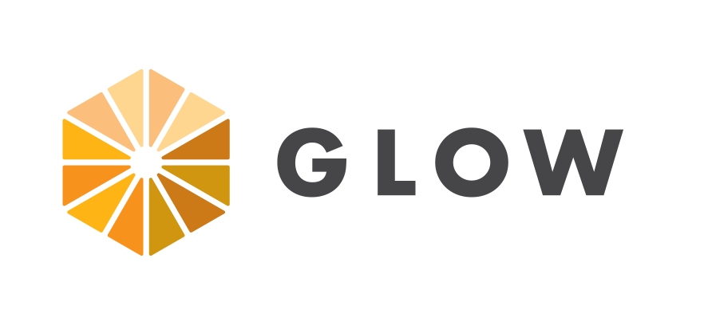

[](https://circleci.com/gh/projectglow/glow)
[](https://glow.readthedocs.io/en/latest/?badge=latest)



# Building and Testing
This project is built using sbt: https://www.scala-sbt.org/1.0/docs/Setup.html

Start an sbt shell using the `sbt` command.

To compile the main code:
```
compile
```

To run all tests:
```
test
```

To test a specific suite:
```
testOnly *VCFDataSourceSuite
```

If you use IntelliJ, you'll want to set up [scalafmt on save](https://scalameta.org/scalafmt/docs/installation.html).

To test or testOnly in remote debug mode with IntelliJ IDEA set the remote debug configuration in IntelliJ to 'Attach to remote JVM' mode and a specific port number (here the default port number 5005 is used) and then modify the definition of options in groupByHash function in build.sbt to
```
val options = ForkOptions().withRunJVMOptions(Vector("-Xmx1024m")).withRunJVMOptions(Vector("-agentlib:jdwp=transport=dt_socket,server=y,suspend=y,address=5005"))
```

To run Python tests, you must install and activate the conda environment in
`python/environment.yml`. You can then run tests from sbt:
```
python/test
```

These tests will run with the same Spark classpath as the Scala tests.
